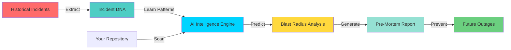
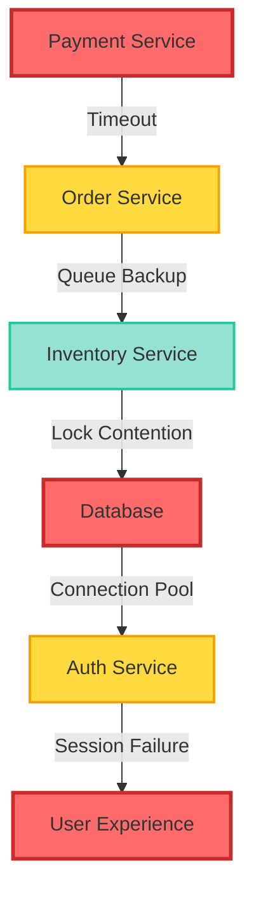
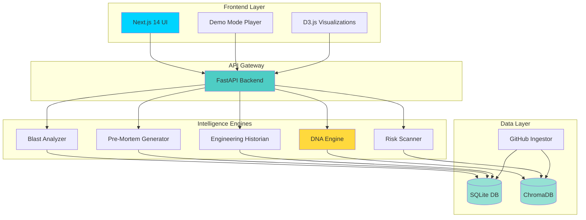
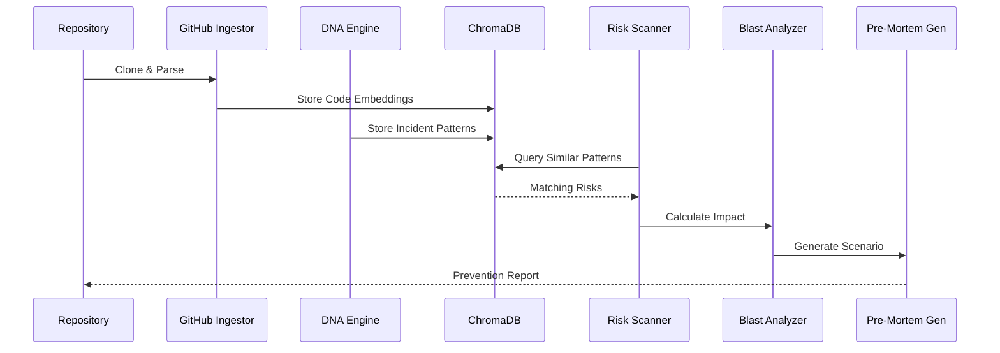

<div align="center">

# 🔮 NEXUS

**Predict Incidents Before They Happen**

*The world's first AI-powered predictive reliability platform that learns from incident history to prevent future outages*

[](https://fastapi.tiangolo.com/)
[](https://nextjs.org/)
[](https://www.typescriptlang.org/)
[](https://www.python.org/)
[](https://www.trychroma.com/)

[🎬 Watch Demo](#-demo-flow) • [📖 Documentation](#-architecture) • [🚀 Quick Start](#-quick-start) • [💡 Features](#-core-features)

---

### 🎥 Demo Preview

*[Demo GIF Placeholder - Cinematic walkthrough of NEXUS analyzing a repository and predicting cascading failures]*


</div>

---

## 🔥 The Problem

Modern distributed systems fail in complex, cascading ways. Traditional observability tools are **reactive** — they only tell you what broke *after* the damage is done.

**The harsh reality:**

- 🚨 **Incidents happen without warning** — Teams scramble to understand what went wrong
- 💸 **Downtime costs millions** — Every minute of outage impacts revenue and reputation  
- 🔄 **Patterns repeat** — The same architectural failures happen across different systems
- 🌊 **Cascading failures are invisible** — A small bug in one service can bring down entire platforms
- 📊 **Post-mortems gather dust** — Valuable incident learnings are never operationalized

**What if you could predict incidents before they happen?**

---

## ✨ The Solution

**NEXUS** is a predictive reliability platform that learns from your incident history and prevents future outages.

### How It Works



**NEXUS doesn't just monitor — it predicts:**

1. **📚 Learns Incident DNA** — Extracts architectural failure patterns from past incidents
2. **🔍 Scans Your Codebase** — Analyzes repositories for patterns matching known failures
3. **💥 Predicts Blast Radius** — Simulates cascading failures before they happen
4. **📝 Generates Pre-Mortems** — Creates detailed failure scenarios with prevention strategies
5. **🎯 Prevents Outages** — Gives teams actionable intelligence to fix issues proactively

---

## 🎯 Core Features

### 🧬 Incident DNA Engine

Automatically extracts architectural failure patterns from historical incidents. Each incident becomes a learning opportunity.

**What it captures:**
- Root cause patterns
- Service dependencies
- Failure propagation paths
- Environmental conditions
- Recovery strategies

### 🔍 GitHub Intelligence

Deep repository analysis that understands your system architecture:

- **Code structure mapping** — Identifies services, dependencies, and critical paths
- **Pattern matching** — Finds code patterns similar to past incidents
- **Dependency graph** — Maps service relationships and communication patterns
- **Risk scoring** — Quantifies likelihood and impact of potential failures

### 💥 Blast Radius Simulation

Predicts how failures cascade through your system:



**Analyzes:**
- Service dependency chains
- Failure propagation speed
- Impact on user experience
- Revenue at risk
- Recovery complexity

### 📊 Pre-Mortem Intelligence

Generates detailed failure scenarios *before* incidents occur:

- **Failure narrative** — Step-by-step breakdown of how the incident would unfold
- **Timeline simulation** — Predicted sequence of events with timestamps
- **Impact assessment** — Affected services, users, and business metrics
- **Prevention strategies** — Specific code changes and architectural improvements
- **Monitoring recommendations** — Alerts and dashboards to detect early warning signs

### 🕰️ Engineering Historian

Transforms incident data into institutional knowledge:

- **Pattern library** — Searchable database of failure patterns
- **Trend analysis** — Identifies recurring architectural weaknesses
- **Team learning** — Surfaces insights from past incidents
- **Knowledge preservation** — Prevents loss of critical incident context

### 📈 Executive Intelligence

Business-focused incident insights for leadership:

- **Reliability metrics** — MTTR, MTBF, incident frequency trends
- **Risk portfolio** — Current system vulnerabilities and priorities
- **Cost of downtime** — Revenue impact projections
- **Prevention ROI** — Value of proactive fixes vs reactive firefighting

### 🎬 Cinematic Demo Mode

Immersive demonstration experience for stakeholders:

- **Live repository analysis** — Watch AI intelligence pipeline in real-time
- **Animated visualizations** — Beautiful blast radius graphs and timelines
- **Narrative storytelling** — Guided walkthrough of incident prediction
- **Wow moments** — Showcases NEXUS capabilities dramatically

---

## 🏗️ Architecture

### System Overview



### Technology Stack

| Layer | Technology | Purpose |
|-------|-----------|---------|
| **Frontend** | Next.js 14 + TypeScript | Modern React framework with App Router |
| **UI Components** | Tailwind CSS + shadcn/ui | Enterprise-grade design system |
| **Backend** | FastAPI + Python 3.8+ | High-performance async API |
| **AI Intelligence** | ChromaDB | Vector similarity search for pattern matching |
| **Database** | SQLite | Lightweight, embedded database |
| **Visualization** | D3.js (planned) | Interactive graphs and timelines |
| **Fonts** | Geist Sans & Mono | Premium typography |

---

## 🎬 Demo Flow

### The 2-Minute Judge Experience

**Perfect for hackathon demonstrations:**

1. **🚀 Launch Demo Mode** (10 seconds)
   - Open NEXUS dashboard
   - Click "Demo Mode" in sidebar
   - System loads cinematic interface

2. **📂 Paste GitHub Repository** (15 seconds)
   - Enter demo repository URL
   - Click "Analyze Repository"
   - Watch AI intelligence pipeline activate

3. **🧬 Watch DNA Extraction** (30 seconds)
   - Real-time pattern recognition
   - Incident DNA matching visualization
   - Risk patterns identified with confidence scores

4. **💥 Review Blast Radius** (30 seconds)
   - Interactive dependency graph
   - Cascading failure simulation
   - Impact metrics and affected services

5. **📝 Analyze Pre-Mortem** (30 seconds)
   - Detailed failure scenario
   - Timeline of predicted events
   - Prevention strategies and recommendations

6. **✅ The Wow Moment** (15 seconds)
   - "This incident hasn't happened yet"
   - "NEXUS predicted it before any code was deployed"
   - "Your team can fix it now, not during an outage"

**Total Time:** 2 minutes | **Impact:** Maximum

---

## 📸 Screenshots

<div align="center">

### Dashboard Overview


### Blast Radius Visualization


### Engineering Timeline


### Executive Intelligence


### Demo Mode Experience


</div>

---

## 🧠 Technical Innovation

### Deterministic AI Intelligence

NEXUS uses **vector similarity search** to match code patterns against historical incident DNA. This isn't probabilistic guessing — it's pattern recognition based on real failure data.

**Key innovations:**

- **Architectural failure pattern learning** — Extracts reusable patterns from incidents
- **Predictive reliability engineering** — Shifts from reactive to proactive
- **Cascading failure simulation** — Models complex system interactions
- **Context-aware risk scoring** — Considers system architecture and dependencies

### The Intelligence Pipeline



---

## 💼 Why This Matters

### Business Impact

| Metric | Traditional Approach | With NEXUS |
|--------|---------------------|------------|
| **Incident Prevention** | Reactive firefighting | Proactive risk elimination |
| **MTTR** | Hours to days | Minutes (or prevented entirely) |
| **Revenue Protection** | Lost during outages | Protected through prevention |
| **Team Efficiency** | Constant firefighting | Focus on innovation |
| **Knowledge Retention** | Lost with team turnover | Institutionalized in DNA |

### Real-World Scenarios

**Scenario 1: Payment Retry Storm**
- **Without NEXUS:** Payment service crashes, cascades to orders, 2-hour outage, $500K revenue loss
- **With NEXUS:** Pattern detected in code review, fixed before deployment, zero downtime

**Scenario 2: Database Connection Pool Exhaustion**
- **Without NEXUS:** Gradual degradation, difficult to diagnose, 4-hour incident
- **With NEXUS:** Pre-mortem identifies risk, monitoring added, prevented

**Scenario 3: Cascading Timeout Failures**
- **Without NEXUS:** One service timeout brings down entire platform
- **With NEXUS:** Blast radius analysis shows impact, circuit breakers added

---

## 🚀 Quick Start

### Prerequisites

- **Python 3.8+** — [Download](https://www.python.org/downloads/)
- **Node.js 18+** — [Download](https://nodejs.org/)
- **Git** — [Download](https://git-scm.com/)

### Installation

```bash
# Clone the repository
git clone https://github.com/yourusername/Nexus-IntelliBob.git
cd Nexus-IntelliBob

# Start backend
cd backend
python3 -m venv venv
source venv/bin/activate  # Windows: venv\Scripts\activate
pip install -r requirements.txt
python main.py

# Start frontend (new terminal)
cd frontend
npm install
npm run dev
```

### Access Points

- **Frontend:** http://localhost:3000
- **Backend API:** http://localhost:8000
- **API Docs:** http://localhost:8000/docs

### Quick Demo

1. Navigate to **Demo Mode** in the sidebar
2. Paste a GitHub repository URL (or use included demo repos)
3. Click **Analyze Repository**
4. Watch NEXUS predict incidents in real-time

---

## 📚 Documentation

- **[Judge Demo Flow](docs/JUDGE_DEMO_FLOW.md)** — 2-minute demonstration script
- **[Architecture Deep-Dive](docs/ARCHITECTURE.md)** — Technical system design
- **[API Reference](http://localhost:8000/docs)** — Interactive API documentation

---

## 🗺️ Future Roadmap

### Phase 1: Enhanced Intelligence (Q2 2026)
- [ ] **PR Risk Scanning** — Analyze pull requests before merge
- [ ] **CI/CD Integration** — Block deployments with high-risk patterns
- [ ] **Slack Alerts** — Real-time notifications for detected risks

### Phase 2: Live Observability (Q3 2026)
- [ ] **Real-time Monitoring** — Connect to production systems
- [ ] **Anomaly Detection** — Identify deviations from normal patterns
- [ ] **Auto-remediation** — Suggest fixes during incidents

### Phase 3: Enterprise Scale (Q4 2026)
- [ ] **Multi-repository Support** — Analyze entire organizations
- [ ] **Custom Rule Engine** — Define organization-specific patterns
- [ ] **Team Collaboration** — Shared incident knowledge base

---

## 🏆 Built For

- **Hackathon Judges** — Impressive demo, real innovation
- **Engineering Teams** — Practical incident prevention
- **SRE Leaders** — Proactive reliability engineering
- **CTOs** — Strategic risk management

---

## 📄 License

MIT License - See [LICENSE](LICENSE) for details

---

<div align="center">

**🔮 NEXUS — Predict Incidents Before They Happen**

*Built with ❤️ for a more reliable future*

[⭐ Star on GitHub](https://github.com/yourusername/Nexus-IntelliBob) • [🐛 Report Bug](https://github.com/yourusername/Nexus-IntelliBob/issues) • [💡 Request Feature](https://github.com/yourusername/Nexus-IntelliBob/issues)

</div>