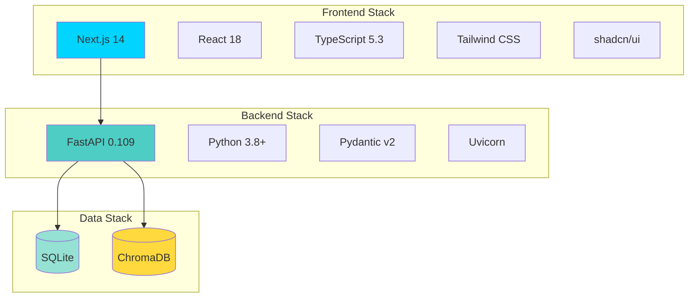
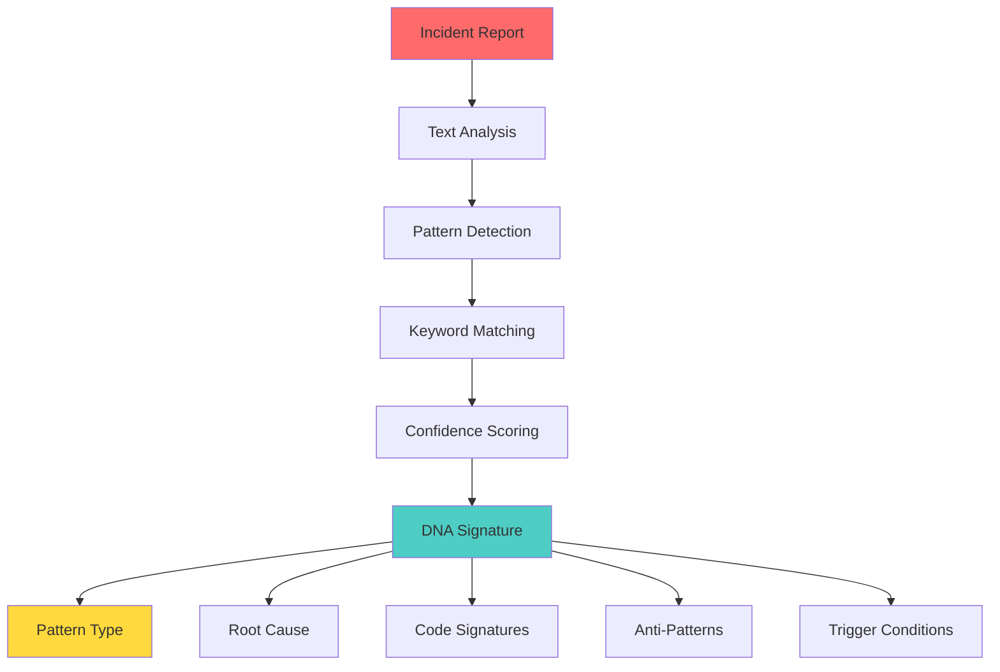
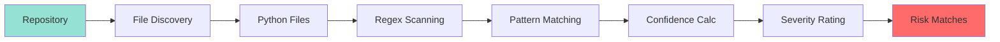
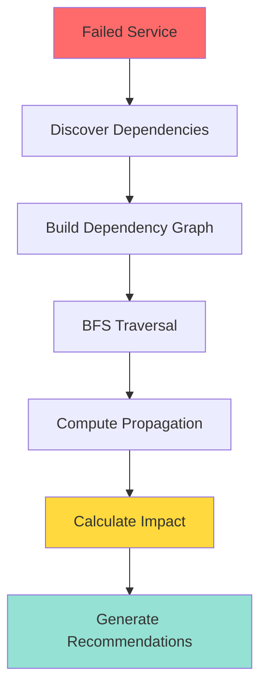
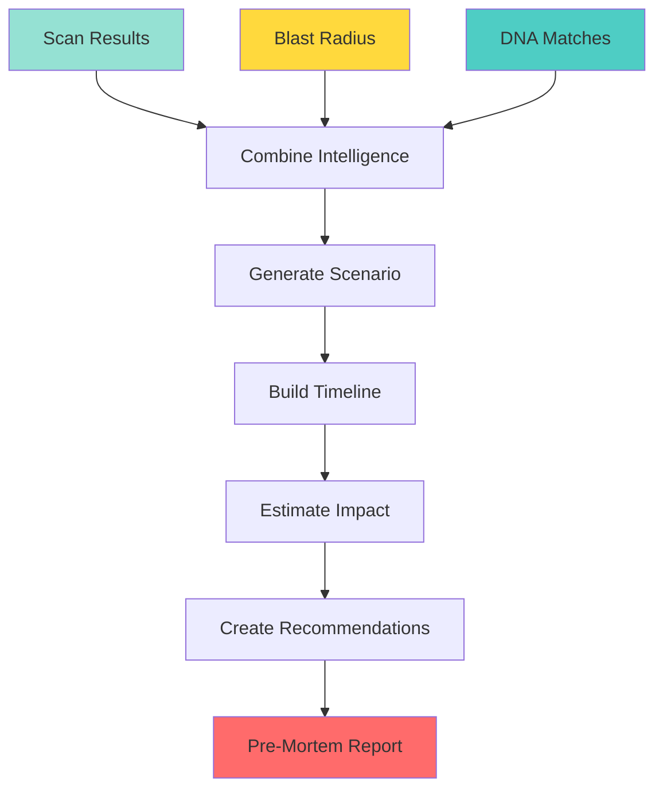
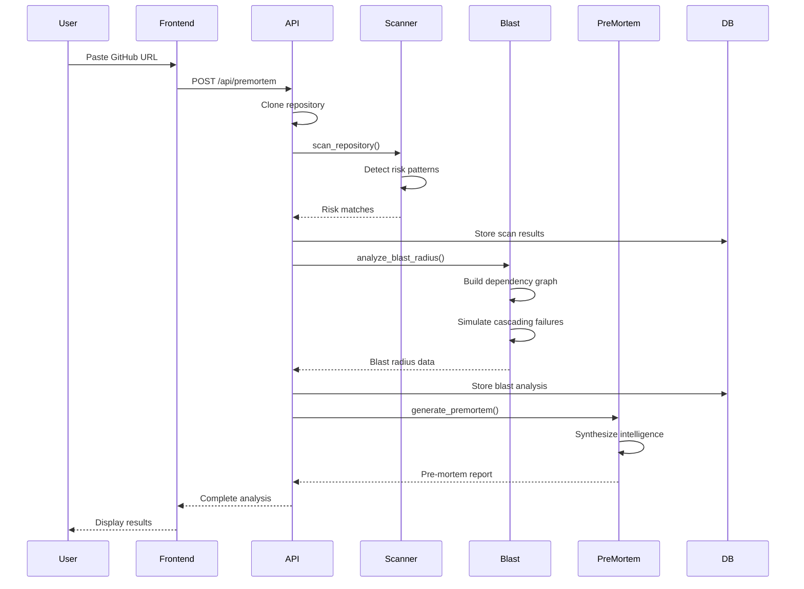
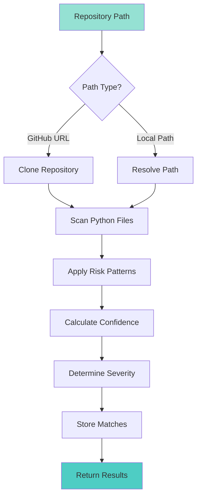
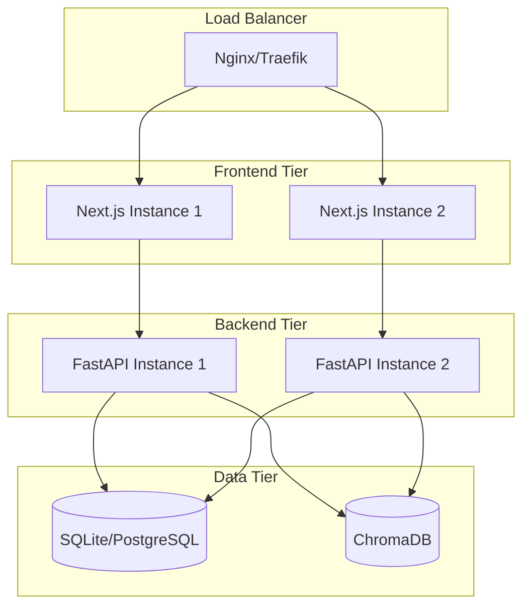
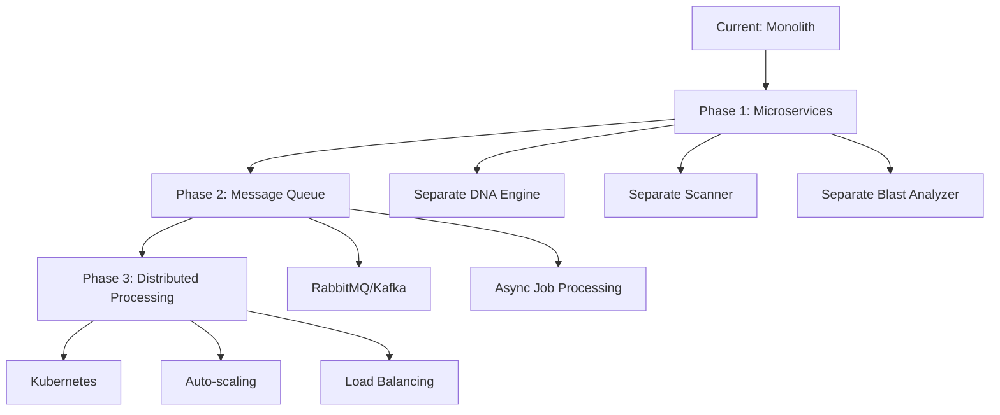

# 🏗️ NEXUS Architecture Deep-Dive

**Technical Documentation for the Predictive Reliability Platform**

This document provides a comprehensive technical overview of NEXUS's architecture, intelligence engines, data flow, and implementation details.

---

## 📋 Table of Contents

1. [System Overview](#system-overview)
2. [Architecture Layers](#architecture-layers)
3. [Intelligence Engines](#intelligence-engines)
4. [Data Flow](#data-flow)
5. [API Design](#api-design)
6. [Database Schema](#database-schema)
7. [Frontend Architecture](#frontend-architecture)
8. [Deployment Architecture](#deployment-architecture)
9. [Security & Performance](#security--performance)
10. [Scalability Considerations](#scalability-considerations)

---

## 🎯 System Overview

NEXUS is a predictive reliability platform built on a microservices-inspired architecture with specialized intelligence engines. The system learns from historical incidents, analyzes code repositories, and predicts cascading failures before they occur.

### Core Principles

- **Deterministic AI Intelligence** — Pattern matching based on real incident data, not probabilistic guessing
- **Separation of Concerns** — Each engine has a single, well-defined responsibility
- **Fail-Safe Design** — Graceful degradation when components fail
- **Observable by Default** — Comprehensive logging and error handling

### Technology Stack



---

## 🏛️ Architecture Layers

### Layer 1: Presentation Layer (Frontend)

**Technology:** Next.js 14 with App Router, TypeScript, Tailwind CSS

**Responsibilities:**
- User interface rendering
- Real-time visualization updates
- API communication
- State management
- Demo mode orchestration

**Key Components:**
```
frontend/
├── app/                    # Next.js App Router pages
│   ├── page.tsx           # Dashboard
│   ├── demo/              # Demo mode
│   ├── scan/              # Repository scanner
│   ├── blast/             # Blast radius viewer
│   ├── premortem/         # Pre-mortem reports
│   └── incidents/         # Incident management
├── components/            # React components
│   ├── BlastGraph.tsx     # D3.js blast radius visualization
│   ├── DemoModePlayer.tsx # Cinematic demo orchestrator
│   ├── DNACard.tsx        # Incident DNA display
│   ├── PreMortemReport.tsx # Pre-mortem viewer
│   └── EngineeringTimeline.tsx # Timeline visualization
└── lib/
    ├── api.ts             # API client
    ├── constants.ts       # Configuration
    └── utils.ts           # Utilities
```

### Layer 2: API Gateway (FastAPI)

**Technology:** FastAPI with async/await, CORS middleware

**Responsibilities:**
- Request routing
- Input validation (Pydantic)
- Error handling
- CORS management
- API documentation (OpenAPI)

**Endpoints:**
```python
GET  /health                    # Health check
GET  /api/dashboard-stats       # Dashboard metrics
GET  /api/incidents             # List incidents
POST /api/extract-dna           # Extract incident DNA
POST /api/scan-repo             # Scan repository
POST /api/blast-radius          # Compute blast radius
POST /api/premortem             # Generate pre-mortem
POST /api/engineering-timeline  # Generate timeline
```

### Layer 3: Intelligence Engines

**Technology:** Python modules with specialized algorithms

**Engines:**
1. **DNA Engine** — Incident pattern extraction
2. **Risk Scanner** — Code pattern detection
3. **Blast Analyzer** — Cascading failure simulation
4. **Pre-Mortem Generator** — Failure scenario synthesis
5. **Engineering Historian** — Timeline generation
6. **Repository Ingestor** — GitHub integration

### Layer 4: Data Layer

**Technology:** SQLite (relational), ChromaDB (vector)

**Responsibilities:**
- Incident storage
- Repository metadata
- Risk matches
- Blast radius results
- Vector embeddings (future)

---

## 🧠 Intelligence Engines

### 1. DNA Engine (`dna_engine.py`)

**Purpose:** Extract structured failure patterns from incident reports

**Algorithm:**



**Pattern Types Detected:**
- `RETRY_STORM` — Aggressive retry without backoff
- `CASCADING_TIMEOUT` — Timeout propagation
- `RESOURCE_EXHAUSTION` — Pool/memory exhaustion
- `IMPLICIT_COUPLING` — Hidden dependencies
- `DEADLOCK` — Lock contention
- `THUNDERING_HERD` — Simultaneous request bursts
- `BACKPRESSURE_FAILURE` — Queue overflow

**Key Functions:**
```python
def extract_dna(incident_text: str, incident_title: str) -> Dict:
    """
    Extracts structured DNA from incident report
    Returns: {
        dna_id, pattern_type, root_cause_category,
        code_signatures, anti_patterns, confidence_score
    }
    """

def extract_dna_batch(incident_files: List[str]) -> List[Dict]:
    """Batch process multiple incident files"""
```

**Confidence Scoring:**
```python
confidence = (keyword_matches / total_keywords) * severity_weight
# Range: 0.0 - 1.0
# Threshold: 0.7 for actionable patterns
```

---

### 2. Risk Scanner (`risk_scanner.py`)

**Purpose:** Detect architectural anti-patterns in code repositories

**Algorithm:**



**Risk Patterns Detected:**

| Pattern | Severity | Incident DNA | Blast Radius |
|---------|----------|--------------|--------------|
| `MISSING_TIMEOUT` | 85 | CASCADING_TIMEOUT | 75 |
| `RETRY_WITHOUT_BACKOFF` | 90 | RETRY_STORM | 85 |
| `SMALL_CONNECTION_POOL` | 80 | RESOURCE_EXHAUSTION | 70 |
| `MISSING_CIRCUIT_BREAKER` | 80 | CASCADING_TIMEOUT | 75 |
| `HARDCODED_SECRET` | 95 | AUTH_FAILURE_CASCADE | 90 |
| `UNBOUNDED_CACHE` | 75 | CACHE_MEMORY_LEAK | 70 |

**Detection Logic:**
```python
# Example: Missing timeout detection
regex = r'requests\.(get|post|put|delete)\([^)]*\)(?![^)]*timeout)'

# Confidence adjustment based on context
if "payment" in line or "critical" in line:
    confidence += 0.2  # Higher confidence for critical paths
```

**Severity Calculation:**
```python
final_score = base_score * confidence * context_multiplier

if final_score >= 90: severity = "critical"
elif final_score >= 70: severity = "high"
elif final_score >= 40: severity = "medium"
else: severity = "low"
```

---

### 3. Blast Analyzer (`blast_analyzer.py`)

**Purpose:** Simulate cascading failures through service dependencies

**Algorithm:**



**Service Discovery:**
```python
def _discover_services(repo_path: str) -> Dict[str, str]:
    """
    Discovers services by directory naming convention
    Pattern: *-service directories
    Example: payment-service, auth-service, order-service
    """
```

**Dependency Analysis:**
```python
def _analyze_service_dependencies(service_path: str) -> Set[str]:
    """
    Analyzes code for:
    - HTTP service calls (requests.get/post)
    - Service URL references
    - Shared database usage
    - Import statements
    """
```

**Cascading Failure Simulation:**
```python
def _compute_cascading_failures(failed_service: str) -> Tuple[List, List]:
    """
    Uses BFS to simulate failure propagation:
    1. Start at failed service
    2. Traverse dependents
    3. Add time delays based on criticality
    4. Build propagation chain
    
    Time delays:
    - Critical services: 15 seconds
    - High priority: 30 seconds
    - Medium/Low: 45 seconds
    """
```

**Criticality Scoring:**
```python
def _compute_criticality_score(failed_service: str, affected: List[str]) -> int:
    """
    Score: 0-100
    
    Base scores:
    - auth-service: 95
    - payment-service: 90
    - order-service: 75
    - other: 50
    
    + 10 points per affected service (capped at 100)
    """
```

---

### 4. Pre-Mortem Generator (`premortem_generator.py`)

**Purpose:** Generate detailed failure scenarios before incidents occur

**Algorithm:**



**Report Components:**

1. **Executive Summary**
   - Severity assessment
   - Blast radius scope
   - Primary weakness
   - Confidence score

2. **Failure Scenario**
   - Detailed narrative
   - Trigger conditions
   - Propagation sequence
   - Recovery complexity

3. **Outage Timeline**
   ```
   T+0s:   Initial trigger
   T+15s:  Resource saturation
   T+30s:  Request queueing
   T+45s:  Service A impact
   T+75s:  Service B impact
   T+120s: Platform degradation
   T+180s: Customer impact
   ```

4. **Business Impact**
   - Revenue loss per hour
   - Customer churn risk
   - Brand reputation impact
   - SLA breach likelihood

5. **Mitigation Steps**
   - Immediate actions (0-24h)
   - Short-term fixes (1-7d)
   - Medium-term improvements (1-4w)
   - Long-term architecture (1-3m)

**Confidence Calculation:**
```python
base_confidence = 0.75

if critical_risks > 0:
    base_confidence += 0.15
elif high_risks > 0:
    base_confidence += 0.10

if criticality_score >= 90:
    base_confidence += 0.10

return min(base_confidence, 0.98)  # Cap at 98%
```

---

### 5. Engineering Historian (`historian.py`)

**Purpose:** Generate cinematic AI timelines showing system evolution

**Output:** Chronological event sequence with:
- Repository analysis milestones
- Risk detection events
- Blast radius computation
- Pre-mortem generation
- Executive intelligence summary

---

### 6. Repository Ingestor (`repo_ingestor.py`)

**Purpose:** Clone and analyze GitHub repositories

**Features:**
- GitHub URL detection
- Repository cloning
- Local path resolution
- Cleanup management

---

## 🔄 Data Flow

### Complete Analysis Pipeline



### Repository Scan Flow



---

## 🔌 API Design

### RESTful Principles

- **Resource-oriented URLs** — `/api/incidents`, `/api/scan-repo`
- **HTTP methods** — GET for reads, POST for actions
- **JSON payloads** — Consistent request/response format
- **Error handling** — HTTP status codes + detailed messages

### Request/Response Models (Pydantic)

```python
class ScanRepoRequest(BaseModel):
    repo_path: str

class ScanRepoResponse(BaseModel):
    success: bool
    message: str
    scan_id: int
    total_risks: int
    critical_risks: int
    high_risks: int
    matches: List[Dict]
```

### Error Handling

```python
try:
    result = risk_scanner.scan_repository(repo_path)
except ValueError as ve:
    raise HTTPException(status_code=404, detail=str(ve))
except PermissionError:
    raise HTTPException(status_code=403, detail="Permission denied")
except Exception as e:
    raise HTTPException(status_code=500, detail=f"Internal error: {str(e)}")
```

---

## 💾 Database Schema

### SQLite Tables

```sql
-- Incidents
CREATE TABLE incidents (
    id INTEGER PRIMARY KEY,
    title TEXT NOT NULL,
    description TEXT,
    severity TEXT,
    root_cause TEXT,
    occurred_at TIMESTAMP,
    created_at TIMESTAMP DEFAULT CURRENT_TIMESTAMP
);

-- Incident DNA
CREATE TABLE incident_dna (
    id INTEGER PRIMARY KEY,
    incident_id TEXT UNIQUE,
    pattern_type TEXT,
    root_cause_category TEXT,
    failure_patterns TEXT,  -- JSON array
    code_signatures TEXT,   -- JSON array
    confidence_score REAL,
    created_at TIMESTAMP DEFAULT CURRENT_TIMESTAMP
);

-- Repository Scans
CREATE TABLE repo_scans (
    id INTEGER PRIMARY KEY,
    repo_path TEXT NOT NULL,
    scan_type TEXT,
    total_files_scanned INTEGER,
    matches_found INTEGER,
    started_at TIMESTAMP,
    completed_at TIMESTAMP,
    status TEXT
);

-- Risk Matches
CREATE TABLE risk_matches (
    id INTEGER PRIMARY KEY,
    incident_dna_id TEXT,
    repo_path TEXT,
    file_path TEXT,
    line_number INTEGER,
    pattern_matched TEXT,
    confidence_score REAL,
    risk_level TEXT,
    description TEXT,
    recommendation TEXT,
    created_at TIMESTAMP DEFAULT CURRENT_TIMESTAMP
);

-- Blast Radius
CREATE TABLE blast_radius (
    id INTEGER PRIMARY KEY,
    risk_match_id INTEGER,
    epicenter_file TEXT,
    epicenter_component TEXT,
    affected_nodes TEXT,  -- JSON array
    total_impact_score REAL,
    cascade_depth INTEGER,
    created_at TIMESTAMP DEFAULT CURRENT_TIMESTAMP
);

-- Pre-Mortems
CREATE TABLE premortems (
    id INTEGER PRIMARY KEY,
    blast_radius_id INTEGER,
    title TEXT,
    executive_summary TEXT,
    failure_scenario TEXT,
    impact_analysis TEXT,
    business_impact TEXT,
    confidence_level REAL,
    created_at TIMESTAMP DEFAULT CURRENT_TIMESTAMP
);
```

### ChromaDB Collections (Future)

```python
# Vector embeddings for semantic search
collection = chroma_client.create_collection(
    name="incident_patterns",
    metadata={"description": "Incident DNA embeddings"}
)

# Store incident patterns as vectors
collection.add(
    documents=[incident_text],
    metadatas=[{"pattern_type": "RETRY_STORM"}],
    ids=[dna_id]
)

# Query similar patterns
results = collection.query(
    query_texts=[code_snippet],
    n_results=5
)
```

---

## 🎨 Frontend Architecture

### Component Hierarchy

```
App Layout
├── Sidebar (Navigation)
├── Dashboard Page
│   ├── MetricCard (Stats)
│   ├── ExecutiveIntelCard
│   └── RepositoryIntelligenceOverview
├── Demo Mode Page
│   ├── DemoModePlayer
│   └── LiveAnalysisStages
├── Scan Page
│   └── RiskMatchCard (List)
├── Blast Radius Page
│   ├── BlastGraph (D3.js)
│   └── FailureTimeline
└── Pre-Mortem Page
    ├── PreMortemReport
    └── EngineeringTimeline
```

### State Management

**Approach:** React hooks + API client

```typescript
// API client (lib/api.ts)
export const api = {
  scanRepository: async (repoPath: string) => {
    const response = await fetch('/api/scan-repo', {
      method: 'POST',
      headers: { 'Content-Type': 'application/json' },
      body: JSON.stringify({ repo_path: repoPath })
    });
    return response.json();
  }
};

// Component usage
const [loading, setLoading] = useState(false);
const [results, setResults] = useState(null);

const handleScan = async () => {
  setLoading(true);
  const data = await api.scanRepository(repoPath);
  setResults(data);
  setLoading(false);
};
```

### Styling System

**Tailwind CSS + CSS Variables**

```css
/* globals.css */
:root {
  --background: 222.2 84% 4.9%;
  --foreground: 210 40% 98%;
  --primary: 217.2 91.2% 59.8%;
  --destructive: 0 62.8% 30.6%;
}

/* Usage */
<div className="bg-background text-foreground border-primary">
```

---

## 🚀 Deployment Architecture

### Development Environment

```bash
# Backend (Terminal 1)
cd backend
python3 -m venv venv
source venv/bin/activate
pip install -r requirements.txt
python main.py  # Runs on :8000

# Frontend (Terminal 2)
cd frontend
npm install
npm run dev  # Runs on :3000
```

### Production Considerations



**Recommendations:**
- **Frontend:** Vercel, Netlify, or Docker container
- **Backend:** Docker + Kubernetes, or AWS ECS
- **Database:** PostgreSQL for production (replace SQLite)
- **Vector DB:** Hosted ChromaDB or Pinecone
- **Monitoring:** Prometheus + Grafana
- **Logging:** ELK stack or Datadog

---

## 🔒 Security & Performance

### Security Measures

1. **CORS Configuration**
   ```python
   app.add_middleware(
       CORSMiddleware,
       allow_origins=["http://localhost:3000"],
       allow_credentials=True,
       allow_methods=["*"],
       allow_headers=["*"]
   )
   ```

2. **Input Validation**
   ```python
   class ScanRepoRequest(BaseModel):
       repo_path: str
       
       @validator('repo_path')
       def validate_path(cls, v):
           if not v or not v.strip():
               raise ValueError("Path cannot be empty")
           return v
   ```

3. **Path Traversal Prevention**
   ```python
   # Resolve and validate paths
   resolved_path = Path(repo_path).resolve()
   if not resolved_path.exists():
       raise ValueError("Path does not exist")
   ```

### Performance Optimizations

1. **Async/Await** — Non-blocking I/O operations
2. **Connection Pooling** — Reuse database connections
3. **Lazy Loading** — Load data on demand
4. **Caching** — Cache scan results (future)
5. **Pagination** — Limit result set sizes

---

## 📈 Scalability Considerations

### Current Limitations

- **SQLite** — Single-writer limitation
- **In-memory processing** — Limited by RAM
- **Synchronous scanning** — One repo at a time

### Scaling Path



### Future Enhancements

1. **Horizontal Scaling**
   - Stateless API servers
   - Shared database cluster
   - Distributed caching (Redis)

2. **Async Processing**
   - Celery task queue
   - Background job workers
   - WebSocket progress updates

3. **Database Migration**
   - PostgreSQL for ACID compliance
   - Read replicas for queries
   - Sharding for large datasets

4. **Caching Strategy**
   - Redis for scan results
   - CDN for static assets
   - Browser caching headers

---

## 🔧 Development Guidelines

### Code Organization

```
backend/
├── main.py              # FastAPI app + routes
├── models.py            # Pydantic models
├── db.py                # Database operations
├── dna_engine.py        # DNA extraction
├── risk_scanner.py      # Pattern detection
├── blast_analyzer.py    # Cascading failures
├── premortem_generator.py  # Report generation
├── historian.py         # Timeline generation
├── repo_ingestor.py     # GitHub integration
└── utils/
    ├── logger.py        # Logging configuration
    └── helpers.py       # Utility functions
```

### Testing Strategy

```python
# Unit tests
def test_dna_extraction():
    incident_text = "Retry storm caused by..."
    dna = extract_dna(incident_text, "Test Incident")
    assert dna['pattern_type'] == 'RETRY_STORM'
    assert dna['confidence_score'] > 0.7

# Integration tests
def test_scan_repository():
    result = scan_repository('demo-repos/payment-system')
    assert result['total_risks'] > 0
    assert 'matches' in result
```

### Logging

```python
import logging

logger = logging.getLogger(__name__)
logger.info(f"Scanning repository: {repo_path}")
logger.warning(f"Risk detected: {risk_type}")
logger.error(f"Scan failed: {error}")
```

---

## 📚 Additional Resources

- **API Documentation:** http://localhost:8000/docs (Swagger UI)
- **Type Definitions:** `frontend/types/index.ts`
- **Database Schema:** `backend/db.py`
- **Pattern Definitions:** `backend/risk_scanner.py` (RISK_PATTERNS)

---

<div align="center">

**🔮 NEXUS — Architected for Reliability**

*Built with precision, designed for scale, optimized for intelligence*

</div>